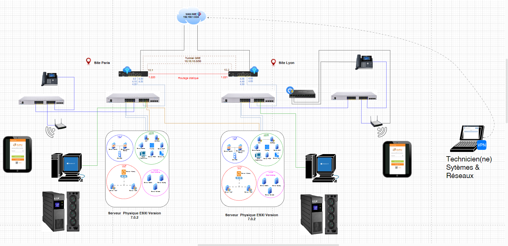
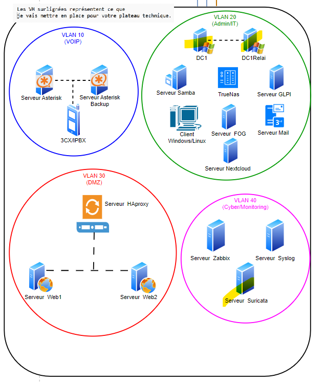
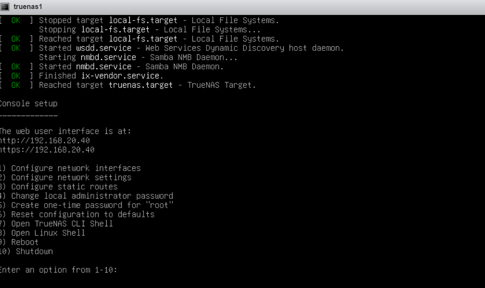
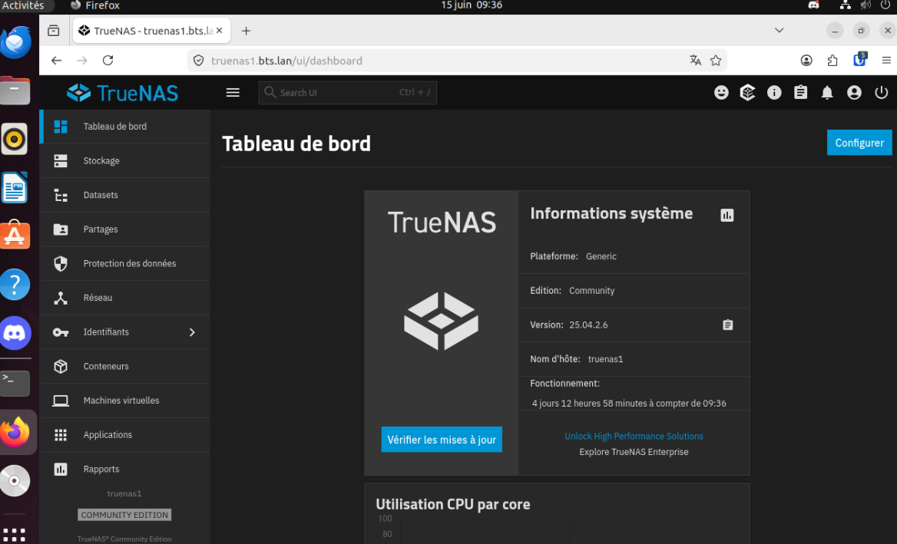
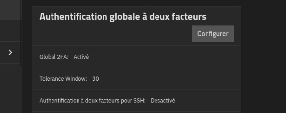
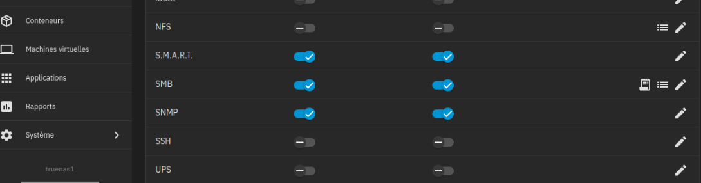
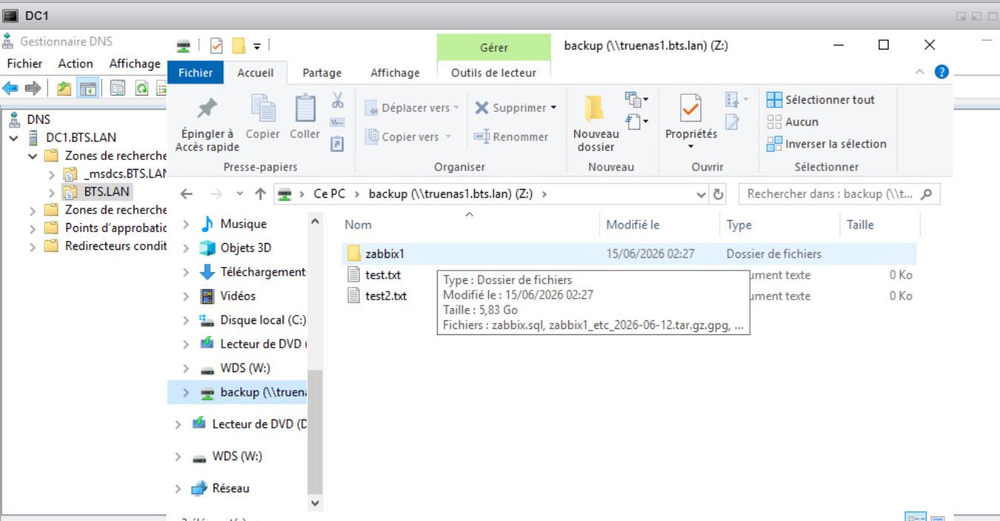
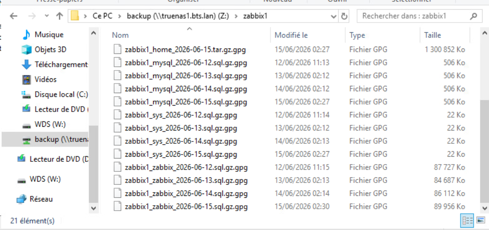
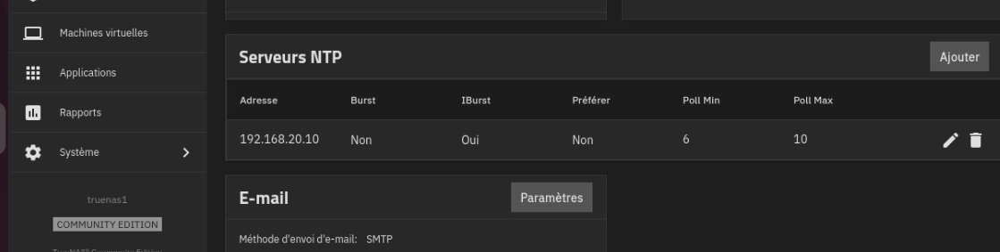

#  Projet TrueNAS SCALE  Infrastructure de Sauvegarde

---

##  Sommaire

1. [Contexte](#contexte)
2. [Cahier des charges](#cahier-des-charges)
3. [Architecture](#architecture)
4. [Installation](#installation)
5. [Configuration statique de l'adresse IP](#configuration-statique-de-ladresse-ip)
6. [Enregistrement de la VM dans le DNS sur le serveur AD](#enregistrement-de-la-vm-dans-le-dns-sur-le-serveur-ad)
7. [Accès à l'interface Web de Truenas](#accès-à-linterface-web-de-truenas)
8. [Mise en place du MFA](#mise-en-place-du-mfa)
9. [Mettre en français](#mettre-en-français)
10. [Création d'un certificat auto-signé](#création-dun-certificat-auto-signé)
11. [Rajouter un volume sur TrueNAS](#rajouter-un-volume-sur-truenas)
12. [Réalisation d'un script de sauvegarde](#réalisation-dun-script-de-sauvegarde)
13. [Restauration](#restauration)
14. [Gestion des quotas utilisateurs](#gestion-des-quotas-utilisateurs)
15. [Commandes utiles](#comandes-utiles)
16. [Problèmes rencontrés](#probleme-rencontrer)

---

## Contexte

Ce projet s'inscrit dans le cadre d'un BTS SIO (Solutions d'Infrastructure, Systèmes et Réseaux). L'objectif est de déployer une solution de **stockage réseau sécurisée** basée sur **TrueNAS SCALE** afin de centraliser les sauvegardes de plusieurs serveurs Linux (Zabbix, Postfix, DNS, etc.) au sein d'un domaine Active Directory.

Le NAS est hébergé sur une machine virtuelle dans un environnement virtualisé, intégré à l'infrastructure existante du domaine `bts.lan`.

---

## Cahier des charges

| Critère | Détail |
|---|---|
| **Système** | TrueNAS SCALE 25.04.2.6 (branche stable) |
| **Authentification** | Double facteur (MFA) via TOTP + Bitwarden |
| **Réseau** | IP statique `192.168.20.40/24`, intégration DNS AD |
| **Stockage** | 1 disque OS (60 Go) + 2 disques données (80 Go chacun) |
| **Partage** | SMB — dataset `backup` |
| **Chiffrement** | GPG (RSA 4096 bits) sur toutes les archives |
| **Automatisation** | Script bash + cron (sauvegarde quotidienne à 2h) |
| **Rétention** | 7 jours de rotation automatique |
| **Sécurité TLS** | Certificat auto-signé via CA interne TrueNAS |
| **Quotas** | Gestion par groupe AD (`bts\utilisateurs du domaine`) |
| **Supervision des logs** | `/var/log/backup_server.log` |
| **Notification** | Envoi d'email en cas d'échec de sauvegarde |

---

## Architecture



---

## Installation

**TrueNAS :iso/TrueNAS-SCALE-25.04.2.6.iso**

- Version stable (release)
- Basée sur la branche actuelle recommandée pour la production
- Correctifs de bugs et stabilité
- Compatible avec la majorité des configurations
- Moins de risques de problèmes


1 Disque de 60 Go
2 disques de 80 Go Chacun


```
> Install / Upgrade
> Sélectionner le disque de 60 Go
> Yes
> Administrative user (truenas_admin).
> Mot de passe : toto
> Yes x2
> Laisser l'instalation se terminer
> Sélectionner Reboot System et valider
```

## configuration statique de l'adresse IP

```
> Sélectionner 1 + Entrée
    Entrée
    Ipv4_dhcp : Mettre NO
    Ipv6_auto : Mettre NO
    Alias : Mettre 192.168.20.40/24
    Save
    Appuyer sur p puis a

> Sélectionner Option 2  + Entrée
    Hostname : truenas1
    Domaine : bts.lan
    ipv4 gateway : 192.168.20.254
    nameserver : 192.168.20.10
    Save
```


## Enregistrement de la VM dans le DNS sur le serveur AD

Le faire sur la vm svrad22


## Accès à l'interface Web de Truenas

```
Sur la vm zabbix2, ouvrir le navigateur et rentrer https://truenas1.bts.lan
    > Avancé
    > Continuer vers truenas.bts.lan (non sécurisé)
    > Identifiant : truenas_admin
    > Mot de passe : ****
```




## Mise en place du MFA

### Activation de la fonctionnalité

```
> System
> Advanced Settings
> Dans l'onglet Global Two Factor Authentication, cliquer sur Configure
> Cocher  Enable Two Factor Authentication Globally
> Save
```

### Génération du code

```
En haut à droite, cliquer sur Truenas_admin
Two Factor authentification
Copier le code qui se trouve en bas du QR Code

Ouvrir le widget Bitwarden et se connecter au compte bitwarden d'un utilisateur qui a les droits admin
Créer
Identifiant
    Nom d'utilisateur : truenas_admin
    Mot de passe : P@ssword*
    Clé d'autentification : saisir la clé copiée précédemment
    Site Web Uri : https://truenas1.bts.lan
    Enregistrer
```



## Mettre en français

```
> System
> General Settings
> Sur le champs Localization, cliquer sur Configure
    >  Language : French
    > Console Keyboard Map : French (Azerty)
    > Timezone : Europe/Paris
    > Format : dd-mm-yy
    > Save 
```

## Création d'un certificat auto-signé


### Étape 1 — créer un certificat

Dans TrueNAS :

Idendifiants

Certificats

```bash:

Dans le champs Autorité de cerification, cliquer sur Ajouter
    Nom :  CA-INT-bts
    Type : AC Interne
    Profil : CA
    Cocher la case Ajouter au magasin de confiance
    Suivant
    Typé de clé : RSA
    Longueur de la clé : 2048
    Algorythme Digest : SHA256
    Durée de vie : 365
    Suivant
    Pays : France
    Etat : Ile-De-France
    Localité : Paris
    Organisation :Imie
    Email : admin@bts.lan
    Nom commun : truenas1.bts.lan
    Nom alternatif de sujet: 
        192.168.20.40
        truenas1.bts.lan
    Suivant
    Usage : SERVER_AUTH
    Laisser cocher les deux champs
    Key Usage COnfig : Laisser tel quel
    Suivant
    Enregistrer
```

```bash
Dans le champs certifiats, cliquer sur Ajouter
    Nom : truenas-cert
    Type : certificat interne
    Profil : HTTPS RSA Certificate
    Cocher la case Ajouter au magasin de confiance
    Suivant
    Normalement les champs sont pré-remplis, sauf la durée de vie où on va mettre 365
    Suivant
     Pays : France
    Etat : Ile-De-France
    Localité : Paris
    Organisation :Imie
    Email : c.********@gmail.com
    Nom commun : truenas1.bts.lan
    Nom alternatif de sujet: 
        192.168.20.40
        truenas1.bts.lan
    Suivant x2
    Enregistrer

    Télécharger le certficat d'AUTORITE créé
    Sur un client windows :
        Une fois créer, cliquer sur le fichier. crt et k'installer (Attention: ordinateur local)
    Sur un client linux : Aller dans le navigateur, parametre, vie privée et sécurité, dans la zone certificats, cliquer sur afficher les certificats et cliquer sur importer. Ensuite important le fichier .crt

```
```
Aller Dans Système
Paramètres généraux
Cliquer sur Paramètres dans la zone UI
Certificate SSL GUI : Sélectionner truenas_cert
Enregistrer
Dans la pop-up qui s'affiche, redémarrer les services
```


## Rajouter un volume sur TrueNAS
> avant d'alumer la vm :
   - cliquer sur edit :
     - dans avancé :
        - modifier la configuration 
           - ajouter : disk.EnableUUID = TRUE

> alumer la vm TrueNAS 
> rentrer sur l'interface graphique de Trunas:
   Effacer 

Ajouter un volume 
   Cliquer sur dataset
   ajouter dataset
   > nom : backup
   > prereglage dataset: SMB
   > Enregistrer puis demmarer le service SMB




## Réalisation d'un script de sauvegarde

Il s'agit d'un script générique applicable sur chaque serveur (Zabbix, Postfix, DNS, etc.).

Le script :

- sauvegarde la configuration du serveur

- envoie la sauvegarde sur TrueNAS

- garde X jours de sauvegarde (rotation)

- écrit un log

- fonctionne avec cron


### Monter le partage TrueNas si ce n'est pas déjà fait

Faire ```df -h``` pour vérifier que le partage est déjà crée et monté.

Si ce n'est pas le cas, suivre la procédure plus haut.


### Chiffrement avec GPG

Installer GPG

```bash
apt install gnupg -y
```

Créer une clé de chiffrement

```bash
gpg --full-generate-key
```
Choisir 1
Saisir 4096
Pendant combien de temps la clef est-elle valable ? (0) : 0
Nom réel : backup_server
Adresse électronique : c.********@gmail.com
Phrase secrète : *****

### Créer le script générique

```bash
vi /usr/local/bin/backup_server.sh
```

```bash
#!/bin/bash

DATE=$(date +%F)
HOST=$(hostname)
BACKUP_ROOT="/backup"
BACKUP_DIR="$BACKUP_ROOT/$HOST"
LOG="/var/log/backup_server.log"
MAIL="c.aitbouali@gmail.com"
GPG_RECIPIENT="backup_server"

# Vérifier que le NAS est monté
if ! mountpoint -q "$BACKUP_ROOT"; then
    echo "[$(date)] ERREUR : NAS non monté" | tee -a $LOG
    echo "Backup FAILED : NAS non monté sur $HOST" | mail -s "Backup ERROR $HOST" $MAIL
    exit 1
fi

mkdir -p $BACKUP_DIR

echo "[$(date)] Début sauvegarde $HOST" >> $LOG

# Sauvegarde configuration système (compressée + chiffrée)
tar -cz /etc | \
gpg --encrypt --recipient "$GPG_RECIPIENT" \
--output $BACKUP_DIR/${HOST}_etc_$DATE.tar.gz.gpg \
&>> $LOG

# Sauvegarde dossiers utilisateurs
tar -cz /home | \
gpg --encrypt --recipient "$GPG_RECIPIENT" \
--output $BACKUP_DIR/${HOST}_home_$DATE.tar.gz.gpg \
&>> $LOG

# Sauvegarde bases MariaDB/MySQL
if command -v mysqldump &> /dev/null
then
    echo "Sauvegarde bases MySQL..." >> $LOG

    for DB in $(mysql -N -e "SHOW DATABASES" -s --skip-column-names); do
        if [[ "$DB" != "information_schema" && "$DB" != "performance_schema" ]]; then

            mysqldump $DB | gzip | \
            gpg --encrypt --recipient "$GPG_RECIPIENT" \
            --output $BACKUP_DIR/${HOST}_${DB}_$DATE.sql.gz.gpg \
            &>> $LOG

        fi
    done
fi

echo "[$(date)] Sauvegarde terminée" >> $LOG

# Rotation sauvegardes > 7 jours
find "$BACKUP_DIR" -type f -name "*.gpg" -mtime +7 -delete

echo "[$(date)] Rotation effectuée" >> $LOG
```

Rendre le script exécutable

```bash
chmod +x /usr/local/bin/backup_server.sh
```

Tester le script

```bash
/usr/local/bin/backup_server.sh
```

Vérifier 

```bash
ls /backup
```

Les fichiers vont apparaitre dans le dossier zabbix1

Pour déchiffrer un de ces fichiers par exemple le fichier zabbix1_etc_2026-03-12.tar.gz.gpg 

```bash
gpg --decrypt /backup/zabbix1/zabbix1_etc_2026-03-12.tar.gz.gpg > backup.tar.gz
```

puis faire 

```bash
ls
```

on voit le fichier backup.tar.gz

On va l décompresser 

mkdir restore_test
tar -xzf backup.tar.gz -C restore_test


ls restore_test/etc/

### Automatiser avec cron

crontab -e

Ajouter

```bash
0 2 * * * /usr/local/bin/backup_server.sh
```

Pour tester rapidement que ca fonctionne on peut mettre à la place la commande suivante afin que ca sauvegarde toutes les 15 minutes


```bash
*/15 * * * * /usr/local/bin/backup_server.sh
```


Vérifier que la tâche est enregistrée


**SUR l'AD:**



## Restauration :

**Sur le serveur Truenas**, sélectionner l'option 8

ls /backup/zabbix1

on voit zabbix1_zabbix_2026-03-12.sql.gz.gpg


on obtient zabbix.sql

### Sur le serveur Zabbix

> Arrêter Zabbix

  > systemctl stop zabbix-server

   > Se connecter à MySQL

     mysql

   > Supprimer la base Zabbix

     DROP DATABASE zabbix;

   > Recréer la base

    CREATE DATABASE zabbix
    CHARACTER SET utf8
    COLLATE utf8_bin;

Puis quitter :
> exit


Aller sur zabbix1.bts.lan : 

On voit que la base de données est supprimée

Maintenant on va restaurer la sauvegarde

```bash
gpg --decrypt /backup/zabbix1/zabbix1_zabbix_2026-03-12.sql.gz.gpg | gunzip | mysql zabbix
```

On redemarre Zabbix

systemctl start zabbix-server


On vérifier que ca fonctionne à nouveau

Se reconnecter à MySQL :

mysql
USE zabbix;
SHOW TABLES;

On constate qu'il y a de nouveau des tables donc la restauration a fonctionné.

Et on peut le voir graphiquement en allant sur zabbix : zabbix1.bts.lan

### Gestion des quotas utilisateurs
```bash

> Datasets
> Dans la zone Gestion espace du dataset, cliquer sur Gérer les quotas du groupe
> Ajouter
> Quota de données sur les utilisateurs (Exemples : 500 KiB, 500M, 2 TB) : 1 GB
> Quota objet utilisateur : 0
> Appliquer des quotas aux utilisateurs sélectionnés 
> Appliquer aux utilisateurs : Sélectionner le(s) utilisateurs
> Enregistrer
```

**PS : TrueNAS ne permet PAS nativement d'appliquer automatiquement un quota à tous les utilisateurs AD d'un coup
On peut mettre alors en place un quota d'un groupe (bts\utilisateurs du domaine)**


## COMANDES UTILES :

Vérifier les logs
```bash
cat /var/log/backup_server.log
```

Déchiffrer la sauvegarde
```bash
gpg --decrypt /backup/zabbix1/zabbix1_zabbix_2026-03-12.sql.gz.gpg > zabbix.sql.gz
```

Décompresser la sauvegarde :
```bash
gunzip zabbix.sql.gz
```


# Probleme rencontrer :

Une différence d'heure a été constatée entre le serveur TrueNAS et l'Active Directory, ce qui provoquait des erreurs lors de l'utilisation de l'authentification multifacteur (MFA).

*Solution apportée* : augmentation de la plage de tolérance horaire afin de permettre l'authentification malgré un léger décalage entre les deux systèmes.

*Résultat* : l'authentification MFA fonctionne correctement.  

